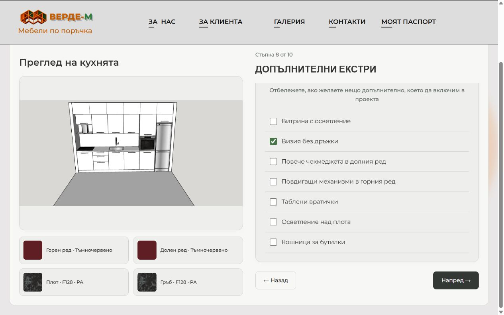

# Straight Kitchen canonical release — 2026-10-06

## Release status

Published successfully to https://www.verde-m.com/prava-kuhnya and the configured apex/Webflow domains. Final live HTML returns HTTP 200 and loads all six runtime modules plus CSS from frontend commit `46d1df1e04812f55d075553a48789a59921abc06`. Every pinned CDN file returns 200 and matches the local source. Final publish task: `afb0679c-cdde-481d-92d8-91790e93bc9f`.

Prompt rewrite prerequisite remains backend `aaa0890752f868f934e1188d2af2ae92c1c96790`, already deployed before this consolidation. Backend was unchanged and required no new deployment. Frontend consolidation: `0aa3cc9f515821f60552701d40d4e90345bd3fc2`; responsive refinement: `46d1df1e04812f55d075553a48789a59921abc06`. Both were pushed to main. Documentation-only verification commit follows them and does not change the runtime pin.

## Findings and repairs

- Three phase/navigation layers, multiple Back restorers, heading timers and self-writing global observers competed over visibility and layout. One explicit ten-step controller now owns hidden/inert phases, progress, headings, navigation and required configuration/dimension gates.
- Duplicate gallery/filter/search owners and a 50-result cutoff were replaced by one renderer using the unchanged 356/356/172/144 source rows. Canonical selection survives off-page and excluded cards.
- Conflicting fixed widths/heights, inset cards, title offsets and nested calendar grids caused inconsistent appearance and mobile overflow. One scoped gray/charcoal/green stylesheet now owns equal columns, headings, spacing, radius, selection, focus, responsive grids and viewport-aware preview height.
- AI success previously depended on a modal. Explicit planner/loading/generated/error preview states reuse one image/status DOM; decoded success replaces CAD in the left card and hides four summaries. Errors preserve the previous preview. Prompt, payload roles, model/API settings and geometry are unchanged.
- Calendar slot state survived an overriding custom date in storage. Custom-date changes now clear and persist the old selection correctly; slots support keyboard/ARIA states while original CMS availability and submission lock remain.
- Phone duplicated Name serialization identity; extras reused Checkbox identities; five inspiration cards shared one value. Source controls now have distinct names/IDs/data-name, inspiration labels are distinct, and notes/preview-link preparation run synchronously before Webflow serialization. Legacy final-note alias remains.

## Confirmed removals

33 obsolete Webflow embeds were removed; 18 necessary embeds remain. Five replacements are versioned under `webflow/canonical-embeds/`. Obsolete engine phase chapters, inline wizard/Back/title/filter/search/progress patches, modal-success presentation, delayed submit patching and the Prava-specific site-footer global hint observer were removed. Shared cookies, widget, analytics, navigation, Webflow form transport, assets and unrelated page content were preserved. The narrow existing Webflow success observer remains.

Published static script tags decreased from 54 to 25; inline style blocks from 67 to 3. The malformed footer script prefix and stray text disappeared. A full pre-implementation inventory, source code captures and exact custom-code backups were made before edits.

## Verification

| Check | Result |
|---|---|
| Existing frontend pipeline tests | 20/20 pass |
| Full-runtime canonical tests | 15/15 pass |
| Backend critical/enrichment/prompt tests | 52/52 pass |
| Combined automated tests | 87/87 pass |
| JavaScript syntax, six runtime modules | Pass |
| Frontend scoped ESLint | 0 errors, 0 warnings |
| Backend affected-path ESLint | 0 errors, one pre-existing unused-variable warning |
| Backend TypeScript no-emit check | Pass |
| Geometry/enrichment/prompt comparisons | Existing baselines unchanged |
| Local image success/error/retry | Mocked; previous preview retained and single DOM reused |
| CMS booked/pending/blocked dates and submitted lock | Synthetic source cases pass; no real reservation |
| Live all Next/Back transitions | Pass; one visible phase and preserved choices |
| Live material off-page selection | Summary retained after pagination/filter/no-result search |
| Live appliances/extras | Exact variants remain, handleless/deep selection independent |
| Live calendar | Seven dates, 14 slots; selection survives Back, custom date clears slot |
| Live contact/notes | Name/email required, distinct optional phone, final notes present |
| Live console | No errors/warnings during smoke checks |
| Responsive | 1280×800, 1024×768, 768×1024, 390×844; no horizontal overflow |
| Short desktop preview | 1280×529 and 1280×800 local mocked result fits available viewport |

No paid image API call, actual form submission, deployment image generation, asset deletion, or Corner/U-shaped implementation occurred. Custom-date smoke-test text was cleared afterward. Real image generation and booking delivery remain for user testing; no new atomic reservation guarantees are claimed.

## Source and architecture

Primary modules: `prava-smart-form.js`, `prava-flow.js`, `prava-material-gallery.js`, `prava-preview.js`, `prava-submit.js`, `webflow/prava-ai-visualization.js`, `prava-planner.css`. Tests: `tests/prava-canonical.test.mjs`, isolated `tests/fixtures/prava-canonical.html`; tooling: `eslint.config.mjs`, `package.json`. Deployment sources/backups: `webflow/canonical-*`, `webflow/source-backups/*`. Full contract and Straight → Corner migration checklist: [straight-kitchen-canonical-template.md](straight-kitchen-canonical-template.md). Internal audit: [straight-kitchen-preimplementation-audit.md](straight-kitchen-preimplementation-audit.md).

The page keeps the native Webflow form shell. Two equal columns contain the canonical preview and current phase; the final calendar is their sibling within the same form. Engine owns geometry/source controls/calendar; gallery owns material rendering; flow owns phases; preview owns presentation; collector owns the existing queued generation path; submit prepares transport fields. See the canonical document for public classes/data attributes, exact scene boundaries and anti-patterns.

## Known limitations

Existing filename/decor conflicts remain unresolved by design. Unavailable island height/material assignments and ambiguous drawer/glass target allocations remain explicitly unavailable in the authoritative backend scene. Shared site widget duplicate initialization is outside planner scope. Automated frontend tests use the sibling backend test runtime; scoped lint uses its installed ESLint. No framework migration or business-rule change was introduced.

## Visual evidence

